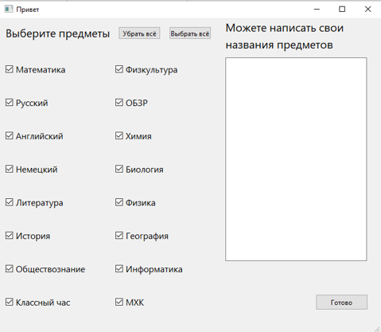
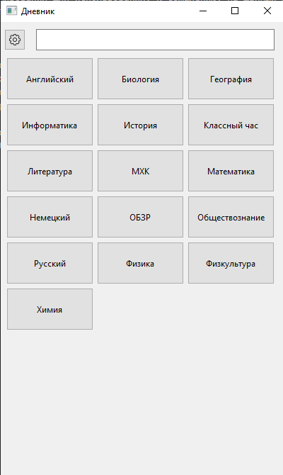
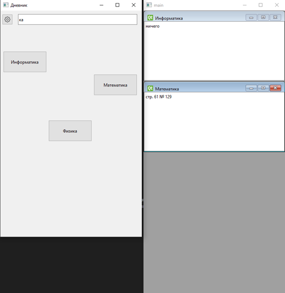

School Diary
==
Быстрый обзор
--
School Diary (в переводе с английского "Школьный дневник") - это программа, которую вы можете использовать для записи домашнего задания по различным предметам. Она довольно проста в использовании, и не требует от вас почти никаких знаний в сфере программирования для использования. К сожалению, на данный момент программа доступна только на русском языке, поэтому и тут всё написано на нём.

Как установить?
--
Для установки достаточно лишь скачать данные из этого репозитория любым удобным образом, например:   
* Нажать на зелёную кнопку "code" сверху
- Затем, нажать на кнопку "Download ZIP" в открывшемся меню
* После чего, достаточно лишь распаковать в любое удобное для вас место и... Вуаля! Всё готово.  

После установки запуск можно осуществлять через файл main.exe (или main.py, предварительно установив библиотеки, перечисленные в "requirements.txt")

Пример работы программы
--
  
_Выбор школьных предметов_

  
_Основное окно_

  
_Фильтр предметов по названию и запись домашнего задания_